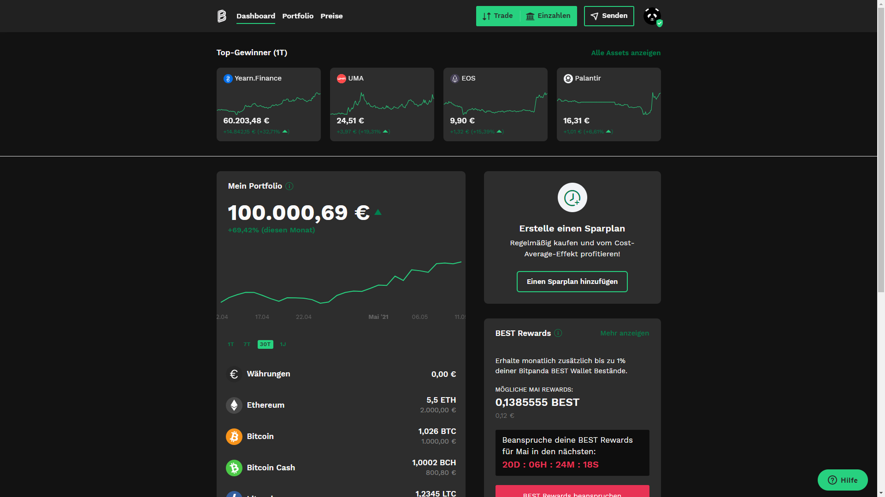

  <h1 align="center">DarkPanda</h1>
  <h3 align="center">Automatic darkmode for Bitpanda Web 🐼🌑</h3>

## 👀 Preview

## ⚡ Download
- [Download project archive](https://github.com/philippdormann/bitpanda_darkmode/archive/refs/heads/main.zip)
- Load in [Chrome Extensions](chrome://extensions/)

## 🏴 Roadmap/ Progress
- [x] Basic README
- [x] Publish to GitHub
- [x] Project Logo™
- [x] Use System Darkmode Preference
- [ ] Display Icon in Extension
- [x] README Screenshots
- [ ] Firefox Testing
- [ ] Supported
  - [x] Page Loader
  - [x] Home
  - [x] Portfolio Overview
  - [x] Prices
  - [x] Pricing Details
  - [x] Modals
  - [x] Context Menus
  - [x] Trade Modal Header
  - [ ] Profile
    - [ ] Account
    - [ ] Card
    - [x] History
    - [ ] My Best
    - [x] Savings-Plan
    - [ ] Contacts
    - [ ] Security
    - [ ] API-Keys